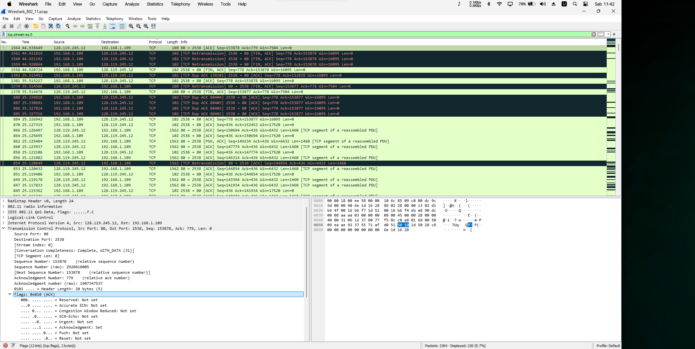
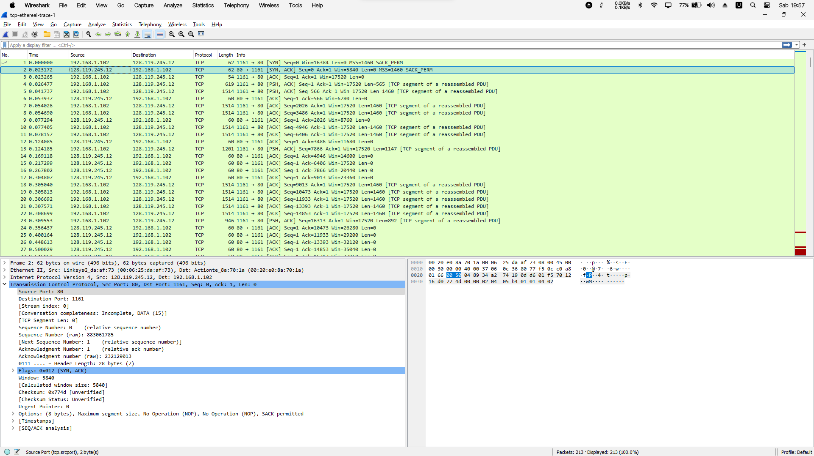
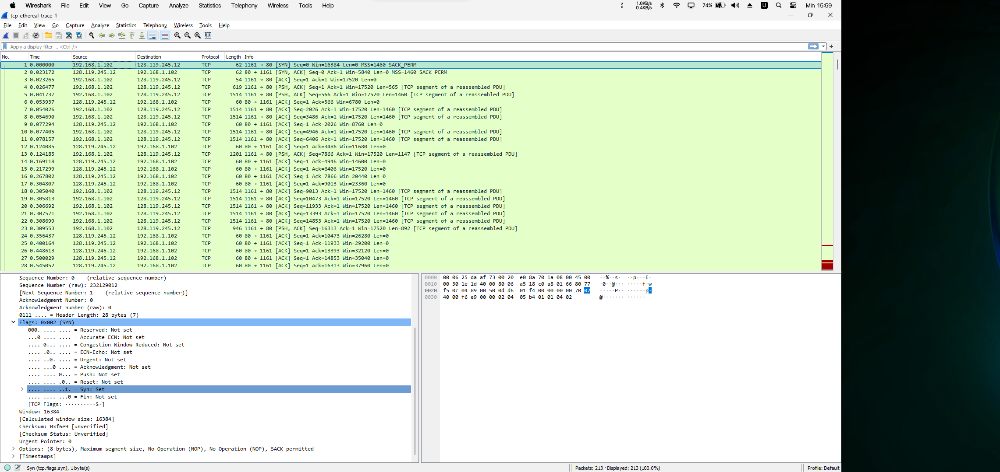
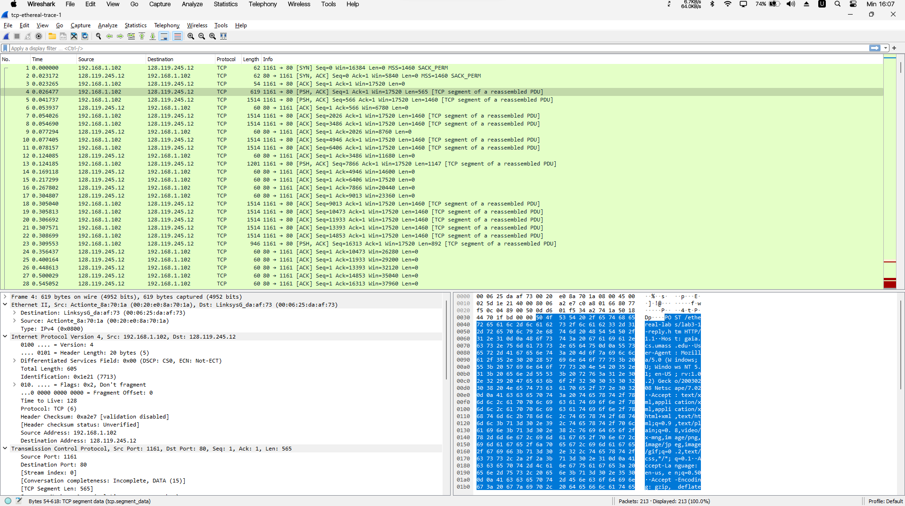
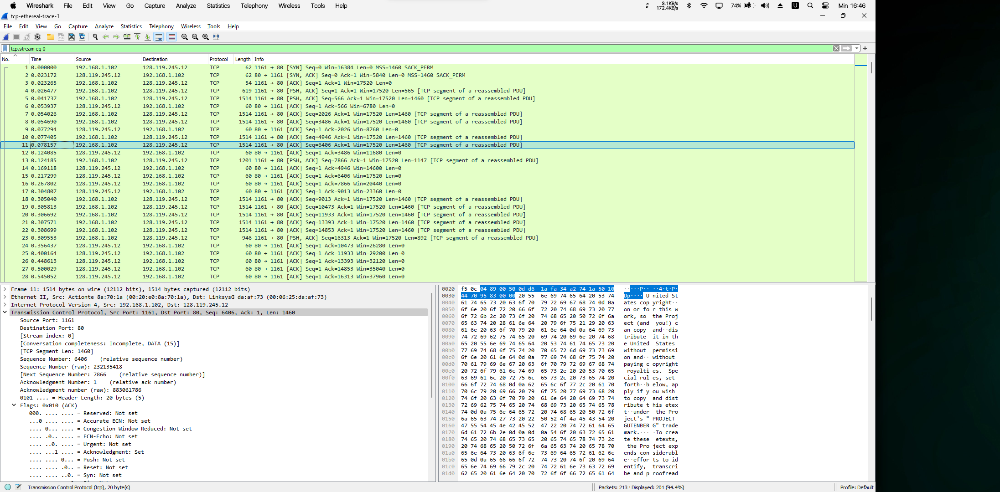
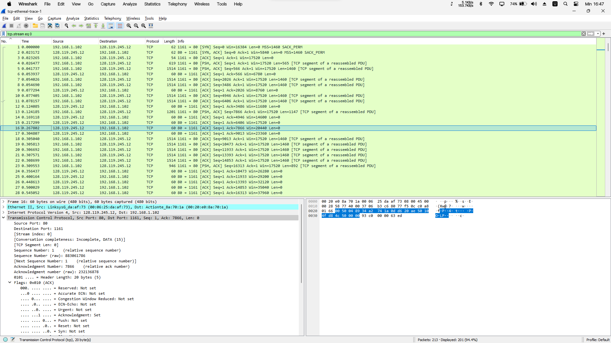

# Ujian Akhir Semester - Komunikasi dan Jaringan Komputer

**Semester Gasal Tahun Ajaran 2024/2025**

**PROGRAM PASCASARJANA TEKNIK INFORMATIKA & KOMPUTER**

**POLITEKNIK ELEKTRONIKA NEGERI SURABAYA**

_Kampus PENS Jl. Raya ITS Keputih Sukolilo Surabaya 60111_

**Mata Kuliah:** Komunikasi dan Jaringan Komputer  
**Dosen:** Ferry Astika Saputra  
**Kelas:** S2 IT A  
**Sifat:** Buku Terbuka  
**Waktu/Jam:** 13:00-17:00 (4 jam)  
**Hari / Tgl:** Senin, 2 Desember 2024

## Pertanyaan (berdasarkan file trace tcp-ethereal-trace-1)

**Petunjuk:** Jawaban berikut berdasarkan file trace `tcp-ethereal-trace-1` yang terdapat di `http://gaia.cs.umass.edu/wireshark-labs/wireshark-traces.zip`

**Jawab pertanyaan berikut untuk segmen TCP:**

1.  **Alamat IP dan Nomor Port TCP yang digunakan oleh komputer klien (sumber) untuk mentransfer file ke gaia.cs.umass.edu? (10%)**

    _Jawaban:_
    Solution: Client computer (source)
    IP address: 192.168.1.102
    TCP port number: 1161

2.  **Apa yang digunakan gaia.cs.umass.edu sebagai alamat IP dan nomor port untuk menerima file? (Lampirkan tangkapan layar tampilan Wireshark Anda) (10%)**

    _Jawaban:_

    Destination computer: gaia.cs.umass.edu
    IP address: 128.119.245.12
    TCP port number: 80

    
    

3.  **Berapakah nomor urut segmen TCP SYN yang digunakan untuk memulai koneksi TCP antara komputer klien dan gaia.cs.umass.edu? Apa yang ada di segmen tersebut yang mengidentifikasi segmen sebagai segmen SYN? (Lampirkan tangkapan layar tampilan Wireshark Anda) (10%)**

        _Jawaban:_

        Solution: Sequence number of the TCP SYN segment is used to initiate the TCP connection between the client computer and gaia.cs.umass.edu. The value is 0 in this trace. The SYN flag is set to 1 and it indicates that this segment is a SYN segment.

    _Tangkapan Layar:_ [Masukkan gambar tangkapan layar di sini]

    

4.  **Berapakah nomor urut segmen SYNACK yang dikirim oleh gaia.cs.umass.edu ke komputer klien sebagai balasan terhadap SYN? Berapakah nilai bidang ACKnowledgement di segmen SYNACK? Bagaimana gaia.cs.umass.edu menentukan nilai tersebut? Apa yang ada di segmen tersebut yang mengidentifikasi segmen sebagai segmen SYNACK? (Lampirkan tangkapan layar tampilan Wireshark Anda) (10%)**

            _Jawaban:_ [Solution: Sequence number of the SYNACK segment from gaia.cs.umass.edu to the

        client computer in reply to the SYN has the value of 0 in this trace.
        3
        The value of the ACKnowledgement field in the SYNACK segment is 1. The value of the
        ACKnowledgement field in the SYNACK segment is determined by gaia.cs.umass.edu
        by adding 1 to the initial sequence number of SYN segment from the client computer (i.e.
        the sequence number of the SYN segment initiated by the client computer is 0.). ]

            _Tangkapan Layar:_
    [The SYN flag and Acknowledgement flag in the segment are set to 1 and they indicate that this segment is a SYNACK segment.](./assets/answare4.png)

5.  **Berapakah nomor urut segmen TCP yang berisi perintah HTTP POST? Perhatikan bahwa untuk menemukan perintah POST, Anda perlu menggali ke dalam bidang konten paket di bagian bawah jendela Wireshark, mencari segmen dengan "POST" di dalam bidang DATANYA. (Lampirkan tangkapan layar tampilan Wireshark Anda) (15%)**

        _Jawaban:_ [Solution: No. 4 segment is the TCP segment containing the HTTP POST command. The

    sequence number of this segment has the value of 1. ]
    _Tangkapan Layar:_
    

6.  **Anggap segmen TCP yang berisi HTTP POST sebagai segmen pertama dalam koneksi TCP. Berapakah nomor urut dari enam segmen koneksi TCP pertama (termasuk segmen HTTP POST)? Pada waktu berapakah setiap segmen dikirim? Kapan ACK untuk setiap segmen diterima? Dengan mempertimbangkan perbedaan antara waktu setiap segmen TCP dikirim dan waktu pengakuannya diterima, berapakah nilai RTT untuk masing-masing dari enam segmen tersebut? Berapakah nilai EstimatedRTT (lihat halaman 237 di buku teks) setelah penerimaan setiap ACK? Asumsikan bahwa nilai EstimatedRTT sama dengan RTT yang diukur untuk segmen pertama, dan kemudian dihitung menggunakan persamaan EstimatedRTT pada halaman 237 untuk semua segmen berikutnya. (30%)**

        _Jawaban:_

            Solution: The HTTP POST segment is considered as the first segment. Segments 1 – 6 are No. 4, 5, 7, 8, 10, and 11 in this trace respectively. The ACKs of segments 1 – 6 are No. 6, 9, 12, 14, 15, and 16 in this trace.

            Segment 1 sequence number: 1
            Segment 2 sequence number: 566
            Segment 3 sequence number: 2026
            Segment 4 sequence number: 3486
            Segment 5 sequence number: 4946
            Segment 6 sequence number: 6406

            | Segment | Sent Time | ACK Received Time | RTT (seconds) |
            | ------- | --------- | ----------------- | ------------- |
            | 1       | 0.026477  | 0.053937          | 0.02746       |
            | 2       | 0.041737  | 0.077294          | 0.035557      |
            | 3       | 0.054026  | 0.124085          | 0.070059      |
            | 4       | 0.054690  | 0.169118          | 0.11443       |
            | 5       | 0.077405  | 0.217299          | 0.13989       |
            | 6       | 0.078157  | 0.267802          | 0.18964       |

            EstimatedRTT = 0.875 * EstimatedRTT + 0.125 * SampleRTT
            EstimatedRTT after the receipt of the ACK of segment 1:
            EstimatedRTT = RTT for Segment 1 = 0.02746 second

            EstimatedRTT after the receipt of the ACK of segment 2:
            EstimatedRTT = 0.875 * 0.02746 + 0.125 * 0.035557 = 0.0285

            EstimatedRTT after the receipt of the ACK of segment 3:
            EstimatedRTT = 0.875 * 0.0285 + 0.125 * 0.070059 = 0.0337

            EstimatedRTT after the receipt of the ACK of segment 4:
            EstimatedRTT = 0.875 * 0.0337+ 0.125 * 0.11443 = 0.0438
            
            EstimatedRTT after the receipt of the ACK of segment 5:
            EstimatedRTT = 0.875 * 0.0438 + 0.125 * 0.13989 = 0.0558

            EstimatedRTT after the receipt of the ACK of segment 6:
            EstimatedRTT = 0.875 * 0.0558 + 0.125 * 0.18964 = 0.0725
            second

    
    

7.  **Berapakah panjang masing-masing dari enam segmen TCP pertama? (Lampirkan tangkapan layar tampilan Wireshark Anda) (15%)**

        _Jawaban:_ [Solution: Length of the first TCP segment (containing the HTTP POST): 565 bytes
                    Length of each of the other five TCP segments: 1460 bytes (MSS)]  
     _Tangkapan Layar:_
    
