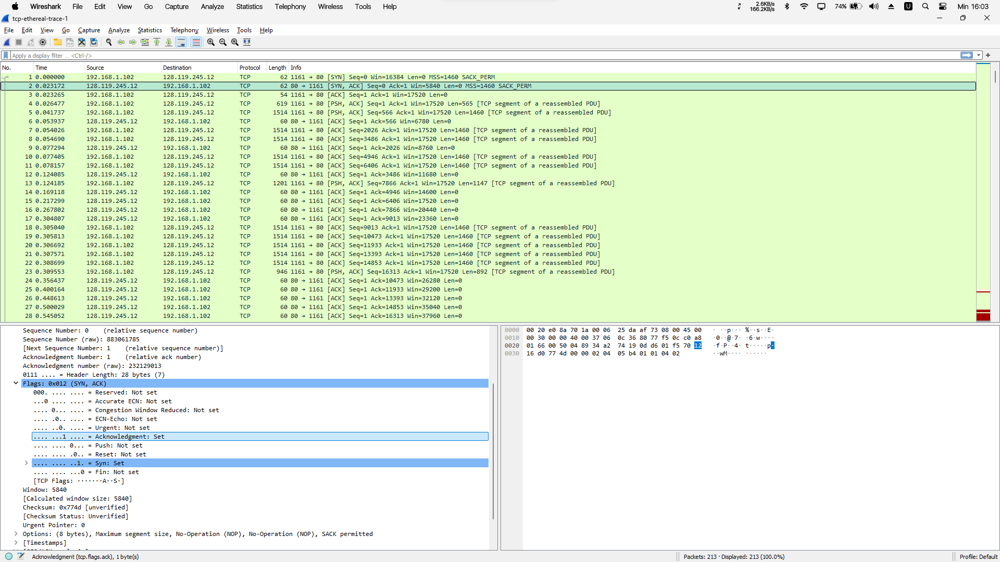
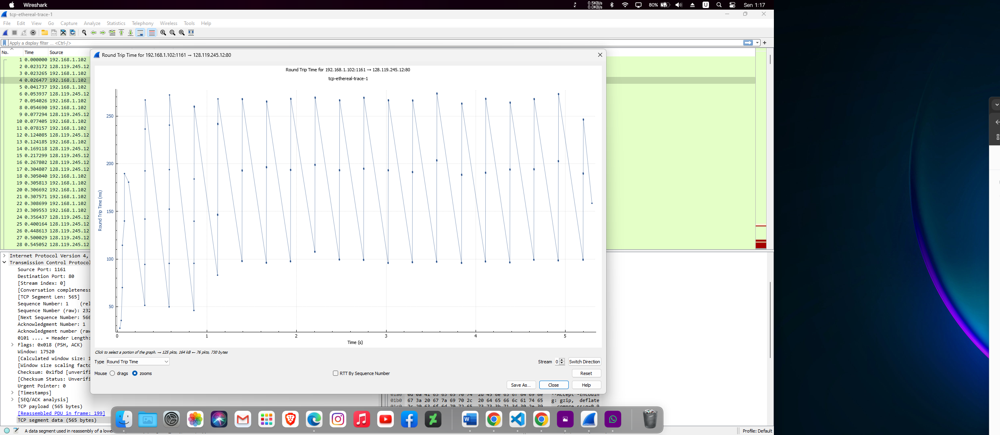
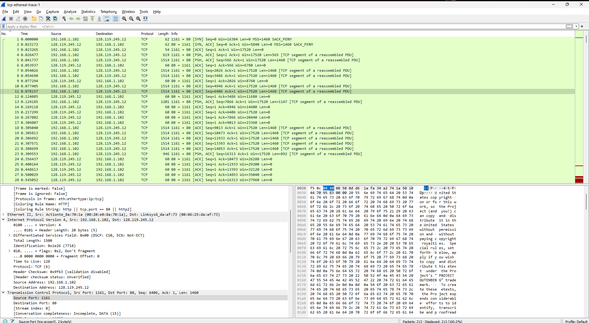

# Ujian Akhir Semester - Komunikasi dan Jaringan Komputer

**Semester Gasal Tahun Ajaran 2024/2025**

**PROGRAM PASCASARJANA TEKNIK INFORMATIKA & KOMPUTER**

**POLITEKNIK ELEKTRONIKA NEGERI SURABAYA**

_Kampus PENS Jl. Raya ITS Keputih Sukolilo Surabaya 60111_

**Mata Kuliah:** Komunikasi dan Jaringan Komputer  
**Dosen:** Ferry Astika Saputra  
**Kelas:** S2 IT A  
**Sifat:** Buku Terbuka  
**Waktu/Jam:** 13:00-17:00 (4 jam)  
**Hari / Tgl:** Senin, 2 Desember 2024

## Question  below are based on the trace file tcp-ethereal-trace-1 in in 
http://gaia.cs.umass.edu/wireshark-labs/wireshark-traces.zip

**Answer the following questions for the TCP segments:**

1.  **What is the IP address and TCP port number used by your client computer (source) to transfer the file to gaia.cs.umass.edu? (10%)**

    _Answer:_
    Solution: Client computer (source)
    IP address: 192.168.1.102
    TCP port number: 1161

2.  **What does gaia.cs.umass.edu use the IP address and port number to receive the file. (Attach the screenshot of your Wireshark's display) (10%)**

    _Answer:_

    Destination computer: gaia.cs.umass.edu
    IP address: 128.119.245.12
    TCP port number: 80

    

3.  **What is the sequence number of the TCP SYN segment that is used to initiate the TCP connection between the client computer and gaia.cs.umass.edu? What is it in the segment that identifies the segment as a SYN segment? (Attach the screenshot of your Wireshark's display) (10%)**

        _Answer:_

        Solution: Sequence number of the TCP SYN segment is used to initiate the TCP connection between the client computer and gaia.cs.umass.edu. The value is 0 in this trace. The SYN flag is set to 1 and it indicates that this segment is a SYN segment.

    

4.  **What is the sequence number of the SYNACK segment sent by gaia.cs.umass.edu to the client computer in reply to the SYN? What is the value of the ACKnowledgement field in the SYNACK segment? How did gaia.cs.umass.edu determine that value? What is it in the segment that identifies the segment as a SYNACK segment? (Attach the screenshot of your Wireshark's display) (10%)**

        _Answer:_
        Sequence number of the SYNACK segment from gaia.cs.umass.edu to the client
        computer in reply to the SYN has the value of 0 in this trace. 3 The value of the
        ACKnowledgement field in the SYNACK segment is 1. The value of the
        ACKnowledgement field in the SYNACK segment is determined by
        gaia.cs.umass.edu by adding 1 to the initial sequence number of SYN segment
        from the client computer (i.e. the sequence number of the SYN segment initiated
        by the client computer is 0.).

    

5.  **What is the sequence number of the TCP segment containing the HTTP POST command? Note that in order to find the POST command, you’ll need to dig into the packet content field at the bottom of the Wireshark window, looking for a segment with a “POST” within its DATA field.(Attach the screenshot of your Wireshark's display) (15%)**

        _Answer:_
        Solution: No. 4 segment is the TCP segment containing the HTTP POST command. The sequence number of this segment has the value of 1.
        

6.  **Consider the TCP segment containing the HTTP POST as the first segment in the TCP connection. What are the sequence numbers of the first six TCP connection segments (including the HTTP POST segment)? At what time was each segment sent? When was the ACK for each segment received? Given the difference between when each TCP segment was sent, and when its acknowledgement was received, what is the RTT value for each of the six segments? What is the EstimatedRTT value (see page 237 in textbook) after the receipt of each ACK? Assume that the value of the EstimatedRTT is equal to the measured RTT for the first segment, and then is computed using the EstimatedRTT equation on page 237 for all subsequent segments. (30%) Note: Wireshark has a nice feature that allows you to plot the RTT for each of the TCP segments sent. Select a TCP segment in the “listing of captured packets” window that is being sent from the client to the gaia.cs.umass.edu server. Then select: Statistics->TCP Stream Graph->Round Trip Time Graph.**

            _Answer:_

                Solution: The HTTP POST segment is considered as the first segment. Segments 1 – 6 are No. 4, 5, 7, 8, 10, and 11 in this trace respectively. The ACKs of segments 1 – 6 are No. 6, 9, 12, 14, 15, and 16 in this trace.

                Segment 1 sequence number: 1
                Segment 2 sequence number: 566
                Segment 3 sequence number: 2026
                Segment 4 sequence number: 3486
                Segment 5 sequence number: 4946
                Segment 6 sequence number: 6406

                | Segment | Sent Time | ACK Received Time | RTT (seconds) |
                | ------- | --------- | ----------------- | ------------- |
                | 1       | 0.026477  | 0.053937          | 0.02746       |
                | 2       | 0.041737  | 0.077294          | 0.035557      |
                | 3       | 0.054026  | 0.124085          | 0.070059      |
                | 4       | 0.054690  | 0.169118          | 0.11443       |
                | 5       | 0.077405  | 0.217299          | 0.13989       |
                | 6       | 0.078157  | 0.267802          | 0.18964       |

                EstimatedRTT = 0.875 * EstimatedRTT + 0.125 * SampleRTT
                EstimatedRTT after the receipt of the ACK of segment 1:
                EstimatedRTT = RTT for Segment 1 = 0.02746 second

                EstimatedRTT after the receipt of the ACK of segment 2:
                EstimatedRTT = 0.875 * 0.02746 + 0.125 * 0.035557 = 0.0285

                EstimatedRTT after the receipt of the ACK of segment 3:
                EstimatedRTT = 0.875 * 0.0285 + 0.125 * 0.070059 = 0.0337

                EstimatedRTT after the receipt of the ACK of segment 4:
                EstimatedRTT = 0.875 * 0.0337+ 0.125 * 0.11443 = 0.0438

                EstimatedRTT after the receipt of the ACK of segment 5:
                EstimatedRTT = 0.875 * 0.0438 + 0.125 * 0.13989 = 0.0558

                EstimatedRTT after the receipt of the ACK of segment 6:
                EstimatedRTT = 0.875 * 0.0558 + 0.125 * 0.18964 = 0.0725
                second

    
    
    

7.  **What is the length of each of the first six TCP segments?(Attach the screenshot of your Wireshark's display) (15%)**

        Solution: Length of the first TCP segment (containing the HTTP POST): 565 bytes Length of each of the other five TCP segments: 1460 bytes (MSS)

    
